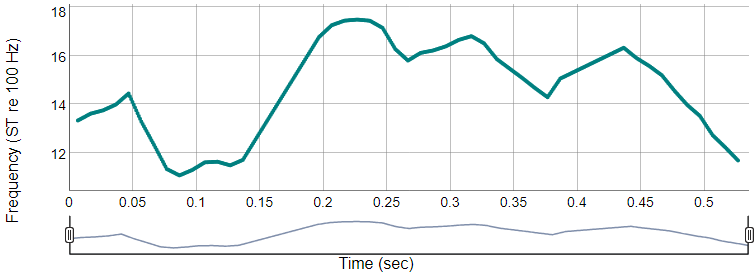

# How to cite this package / toolbox?
We have invested a lot of time and effort in creating mPraat toolbox / rPraat package, please cite it when using it for data analysis.

> Bořil, T., & Skarnitzl, R. (2016). Tools rPraat and mPraat. In P. Sojka, A. Horák, I. Kopeček, & K. Pala (Eds.), Text, Speech, and Dialogue (pp. 367–374). Springer International Publishing.

[Download Tools rPraat and mPraat manuscript .pdf](boril_skarnitzl_2016_Tools_rPraat_and_mPraat_[manuscript].pdf)

The final publication is available at Springer via [DOI 10.1007/978-3-319-45510-5_42](https://dx.doi.org/10.1007/978-3-319-45510-5_42)


[Download BibTeX reference mpraatrpraat2016.bib](mpraatrpraat2016.bib)


# Installation and help

rPraat and mPraat homepage: [https://fu.ff.cuni.cz/praat/](https://fu.ff.cuni.cz/praat/)

CRAN link: [https://CRAN.R-project.org/package=rPraat](https://CRAN.R-project.org/package=rPraat)

Package rPraat at github: [https://github.com/bbTomas/rPraat/](https://github.com/bbTomas/rPraat/)

```{r, eval=FALSE}
install.packages("rPraat")
```

At each R session, you have to initialize the package.
```{r, eval=FALSE}
library(rPraat)
library(dplyr)   # optional, if you want to use the pipeline operator %>%
```


For help and examples, use command
```{r, eval=FALSE}
?nameOfFunction
```
or read .pdf documentation at [https://github.com/bbTomas/rPraat/blob/master/rPraat.pdf](https://github.com/bbTomas/rPraat/blob/master/rPraat.pdf)


# Demo files
To reproduce the following examples, you will need some sample files. Download and extract [rpraat_demo.zip](https://fu.ff.cuni.cz/praat/rpraat_demo.zip) to your Working Directory, it creates `demo` subdirectory.

## Interactive plots using dygraphs (zooming and scrolling)

Mouse drag: Zoom to selection

Mouse Double-click: Default zoom

Shift + mouse drag: plot scroll

## Read and plot Sound, TextGrid, PitchTier, Pitch, IntensityTier, Formant

```{r, echo=FALSE}
library(rPraat)
library(dplyr, warn.conflicts = FALSE)
library(dygraphs)
library(tuneR)
```

```{r, eval=FALSE}
library(rPraat)
library(dplyr)
library(dygraphs)
library(tuneR)  # to read .wav files
```

### Separate plots with synchronised zoom using 'group' argument

```{r, fig.height=2.5}
sndWav <- snd.read("demo/H.wav")
snd.plot(sndWav, group = "my_group1") %>% dyAxis("y", label = "Amplitude")
```

```{r, fig.height=3}
tg <- tg.read("demo/H.TextGrid") %>%
    tg.removeTier("phrase") %>% tg.removeTier("phoneme") %>% tg.removeTier("syllable")

tg.plot(tg, group="my_group1")
```

```{r, fig.height=2.5}
pt <- pt.read("demo/H.PitchTier")
pt.plot(pt, group="my_group1") %>% dyAxis("y", label = "Frequency (Hz)")
```

```{r, fig.height=2.5}
it <- it.read("demo/H.IntensityTier")
it.plot(it, group="my_group1") %>% dyAxis("y", label = "Intensity (dB)")
```

```{r, fig.height=5}
formant <- formant.read("demo/H.Formant")
formant.plot(formant, group="my_group1") %>% dyAxis("y", label = "Frequency (Hz)")
```

```{r, fig.height=5}
pitch <- pitch.read("demo/H.Pitch")
pitch.plot(pitch, group="my_group1", scaleIntensity = TRUE, showStrength = TRUE) %>%
    dyAxis("y", label = "Frequency (Hz)")
```


## Combination of objects in the same plot

```{r}
tg.plot(tg.sample(), pt = pt.sample(), it = it.sample())

tg.plot(tg.sample(), formant = formant.sample())

tg.plot(tg.sample(), pitch = pitch.sample(), pitchShowStrength = TRUE, pt = pt.sample())
```


# Sound files

## Read, write and plot Sound file

```{r, fig.height=3, eval=FALSE}
snd <- snd.read("demo/H.wav")
snd.plot(snd)
```


```{r, fig.height=3, echo=FALSE}
snd <- snd.read("demo/H.wav")
```


```{r, eval=FALSE}
snd.write(snd, "demo/temp.wav")
```

```{r}
snd$fs
snd$nChannels
snd$nBits
snd$nSamples
snd$duration
head(snd$t)
head(snd$sig)
```

### Stereo sound (2-channel)
```{r, fig.height=3, eval=FALSE}
snd <- snd.read("demo/cali.wav")
snd.plot(snd)
```


```{r, fig.height=3, echo=FALSE}
snd <- snd.read("demo/cali.wav")
```

```{r}
snd$nChannels
head(snd$t)
head(snd$sig)
```

## Create a new sound object
```{r, fig.height=3, eval=FALSE}
fs <- 48000   # Hz
duration <- 0.005 # sec
f <- 1000     # Hz
t <- seq(0, duration*fs-1)/fs
sig <- 1*sin(2*pi*f*t)

snd <- list(sig = sig, fs = fs)
snd.plot(snd)
```


```{r, fig.height=3, echo=FALSE}
fs <- 48000   # Hz
duration <- 0.005 # sec
f <- 1000     # Hz
t <- seq(0, duration*fs-1)/fs
sig <- 1*sin(2*pi*f*t)

snd <- list(sig = sig, fs = fs)
```

```{r, fig.height=3, eval=FALSE}
snd.plot(snd, stemPlot = TRUE)
```


```{r}
snd$nBits = 16
snd.write(snd, "demo/temp.wav")

snd <- snd.read("demo/temp.wav")
min(snd$sig)
max(snd$sig)
max(snd$sig)-1
min(snd$sig)+1
mean(snd$sig)
```

## Cut Sound object

```{r,echo=FALSE}
snd <- snd.sample()
snd2 <- snd.cut(snd, Start = 0.2, End = 0.3)
snd3 <- snd.cut0(snd, Start = 2000, End = 3000, units = "samples")
```

```{r,fig.height=2.5, eval=FALSE}
snd <- snd.sample()
snd.plot(snd)
```


```{r,fig.height=2.5, eval=FALSE}
snd2 <- snd.cut(snd, Start = 0.2, End = 0.3)
snd.plot(snd2)
```


```{r,fig.height=2.5, eval=FALSE}
snd3 <- snd.cut0(snd, Start = 2000, End = 3000, units = "samples")
snd.plot(snd3)
```


# TextGrid

## Read, write and plot TextGrid

```{r, echo=FALSE}
tg <- tg.read("demo/H.TextGrid")
```

```{r, fig.height=3.5, eval=FALSE}
tg <- tg.read("demo/H.TextGrid")
tg.plot(tg)
```


```{r, fig.height=2.5, eval=FALSE}
tg.plot(tg[c("phone", "word")]) # Plot selected tiers only
tg.write(tg, "demo/new_file.TextGrid")  # save variable into a new file
```


## Boundary magnet

Align boundaries of intervals in the "word" tier according to closest boundaries in the "phone" tier. If there is no boundary within the tolerance limit in the pattern tier, the boundary position in the target tier is kept at its original position.

```{r, eval=FALSE}
tg <- tg.read("demo/H_shifted.TextGrid")
tg.plot(tg)
tg2 <- tg.boundaryMagnet(tg, targetTier = "word", patternTier = "phone")
tg.plot(tg2)
```


## Get basic info
```{r}
tg <- tg.read("demo/H.TextGrid")
tg.getNumberOfTiers(tg)
length(tg)   # get number of tiers, "low-level access"

tg.getTotalDuration(tg)
tg.getStartTime(tg)
tg.getEndTime(tg)

tg.getTierName(tg, 1)  # get name of the first tier
```

## Tier accessed both by index and name

```{r}
tg.isPointTier(tg, 1)
tg.isPointTier(tg, "phoneme")

tg.isIntervalTier(tg, 1)
tg.isIntervalTier(tg, "phoneme")

tg[[1]]$type
tg$phoneme$type

tg.checkTierInd(tg, "word")  # get index of a tier with specified name
tg.checkTierInd(tg, 4)  # only checks whether TextGrid contains a tier with this index
```

## Point tier

```{r}
tg.getNumberOfPoints(tg, 1)
tg.getNumberOfPoints(tg, "phoneme")
tg.getPointTime(tg, "phoneme", 4)
tg.getLabel(tg, "phoneme", 4)
```

### Point tier "low-level access"

```{r}
length(tg[[1]]$t)   # number of points
tg[[1]]$t[4]
tg[[1]]$label[4]

length(tg$phoneme$t)
tg$phoneme$t[4]
tg$phoneme$label[4]

tg$phoneme$t[5:8]
```

## Interval tier

```{r}
tg.isPointTier(tg, "word")
tg.isIntervalTier(tg, "word")
tg[[4]]$type
tg$word$type

tg.getTotalDuration(tg, "word")
tg.getStartTime(tg, "word")
tg.getEndTime(tg, "word")

tg.getNumberOfIntervals(tg, "word")
tg.getIntervalStartTime(tg, "word", index = 4)
tg.getIntervalEndTime(tg, "word", index = 4)
tg.getIntervalDuration(tg, "word", index = 4)
tg.getLabel(tg, "word", index = 4)
```

### Interval tier "low-level access"

```{r}
length(tg[[4]]$t1)   # number of intervals
tg[[4]]$t1[4]
tg[[4]]$t2[4]
tg[[4]]$label[4]

length(tg$word$t1)
tg$word$t1[4]
tg$word$t2[4]
tg$word$label[4]

tg$word$label[5:8]
```

## Vectorized operations, labels-of-interest

```{r, fig.height=3.5}
labelsOfInterest <- c("i", "i:", "e", "e:", "a", "a:", "o", "o:", "u", "u:")
condition <- tg$phone$label %in% labelsOfInterest

sum(condition) # How many labels satisfy the condition?

dur <- tg$phone$t2[condition] - tg$phone$t1[condition]
mean(dur)
hist(dur, breaks = 10)

# let's put them into a table
tab <- data.frame(Vowel = tg$phone$label[condition], Duration = tg$phone$t2[condition] - tg$phone$t1[condition])

library(dplyr)
tab %>% group_by(Vowel) %>% summarise(DurMean = mean(Duration))
```

## Cut TextGrid
```{r, fig.height=3.5, eval=FALSE}
tg.plot(tg.cut(tg.sample(), 2, 2.2)) # preserve times
```


```{r, fig.height=3.5, eval=FALSE}
tg.plot(tg.cut0(tg.sample(), 2, 2.2)) # time from 0
```


## Find labels in TextGrid

```{r}
tg <- tg.read("demo/H.TextGrid")

# find label "n" in phoneme tier (Point tier)
i <- tg.findLabels(tg, "phoneme", "n")
i # four results and their indices
length(i) # how many results?
i[[1]]  # index of the first result
tg$phoneme$label[unlist(i)]

# find fragments with successive labels "?" "a" in 'phone' tear (Interval tier)
i <- tg.findLabels(tg, "phone", c("?", "a"))
i  
length(i) # 2 results found
i[[1]]  # indices of the first result
i[[2]]  # indices of the second result
tg$phone$label[i[[1]]]
tg$phone$label[i[[2]]]
tg$phone$label[unlist(i)]

# find fragments with successive labels "?" "a" in 'phone' tier
# and return initial and final time of these fragments
t <- tg.findLabels(tg, "phone", c("?", "a"), returnTime = TRUE)
t # 2 results and their initial (t1) and final (t2) time
length(t$t1) # 2 results found (Note: length(t$t1) == length(t$t2) == number of results)
t$t2[1] - t$t1[1]   # duration of the first fragment
t$t2[2] - t$t1[2]   # duration of the second fragment

# find fragments with successive labels "ti" "řeknu" "co" in 'word' tier (Interval tier)
i <- tg.findLabels(tg, "word", c("ti", "řeknu", "co"))
i  
length(i) # 1 result found
i[[1]]           # indices of segments in the first result
length(i[[1]])   # length of the first (and only) result (number of segments)
i[[1]][3]        # index of the third segment in the first result
tg$word$label[i[[1]]]  # all labels in the fragment
# get initial and final time of the fragment
t <- tg.findLabels(tg, "word", c("ti", "řeknu", "co"), returnTime = TRUE)
t
```

## Create syllable tier from phone tier

```{r}
tg <- tg.read("demo/H.TextGrid")
```

Get actual labels of 'phone' tier.

```{r}
collapsed <- paste0(tg$phone$label, collapse = "")
collapsed
```

Edit the collapsed string with labels - insert separators to mark boundaries of syllables.

* There can be segments with empty labels in the original tier (pauses), do not specify them in the pattern.
* Beware of labels that appear empty but they are not (space, new line character etc.) - these segments are handled as classical non-empty labels. See example - one label is " ", therefore it must be specified in the pattern.

```{r, fig.height=3, eval=FALSE}
pattern <- "ja:-ci-P\\ek-nu-t_so-?u-J\\e-la:S- -nej-dP\\i:f-naj-deZ-h\\ut_S-ku-?a-?a-ta-ma-na:"

tg2 <- tg.duplicateTierMergeSegments(tg, "phone", 1, "syll", pattern, sep = "-")
tg.plot(tg2[c("syll", "phone")])
```


## Overview of some TextGrid operations

For all functions, see help `?functionName` for its description and example of use.

```{r, fig.height=3.5, eval=FALSE}
tg <- tg.read("demo/H.TextGrid")
tg.plot(tg)
```


```{r, fig.height=3.5, eval=FALSE}
tg <- tg.removeTier(tg, "syllable")
tg <- tg.removeTier(tg, "phrase")
tg <- tg.removeTier(tg, "phone")

ind <- tg.getPointIndexNearestTime(tg, "phoneme", time = 1.5)
tg <- tg.setLabel(tg, "phoneme", ind, newLabel = "!Q!")

tg <- tg.insertPoint(tg, "phoneme", time = 1.6, label = "NEW")
tg$phoneme$t <- tg$phoneme$t[-(30:40)]   # remove points 30:40
tg$phoneme$label <- tg$phoneme$label[-(30:40)]

tg <- tg.duplicateTier(tg, "word", newInd = 2, newTierName = "WORD2")
tg <- tg.removeIntervalBothBoundaries(tg, "WORD2", index = 6)
tg <- tg.setLabel(tg, "WORD2", index = 5, newLabel = "")
tg <- tg.insertInterval(tg, "WORD2", tStart = 0.9, tEnd = 1.7, label = "NEW LAB")
ind <- tg.getIntervalIndexAtTime(tg, "WORD2", time = 2.3)
tg <- tg.removeIntervalBothBoundaries(tg, "WORD2", ind)
tg.plot(tg)
```


```{r, fig.height=3.5, eval=FALSE}
tgNew <- tg.createNewTextGrid(tMin = 0, tMax = 5)
tgNew <- tg.insertNewIntervalTier(tgNew, newInd = 1, "word")   # the first tier
tgNew <- tg.insertInterval(tgNew, tierInd = 1, tStart = 2, tEnd = 3.5, "hello")
tgNew <- tg.insertInterval(tgNew, tierInd = 1, 4, 4.8, "world")
tgNew <- tg.insertNewIntervalTier(tgNew, newInd = Inf, "word_last")  # the last tier (at this moment)
tgNew <- tg.insertInterval(tgNew, tierInd = "word_last", 2, 3, "ABC")
tgNew <- tg.insertNewPointTier(tgNew, newInd = 2, newTierName = "click")
tgNew <- tg.insertPoint(tgNew, tierInd = 2, time = 2, label = "click")
tgNew <- tg.insertPoint(tgNew, tierInd = 2, time = 4, label = "click")
tgNew <- tg.insertNewPointTier(tgNew, newInd = Inf, newTierName = "pointTierLast")
tgNew <- tg.insertPoint(tgNew, tierInd = "pointTierLast", time = 3, label = "point")
tg.plot(tgNew)
tg.write(tgNew, "demo/ex_output.TextGrid")
```


## Repair continuity problem of TextGrid

Repairs problem of continuity of T2 and T1 in interval tiers. This problem is very rare and it should not appear. However, e.g., automatic segmentation tool Prague Labeller produces random numeric round-up errors featuring, e.g., T2 of preceding interval is slightly higher than the T1 of the current interval. Because of that, the boundary cannot be manually moved in Praat edit window.

```{r}
tgProblem <- tg.read("demo/H_problem.TextGrid")
tgNew <- tg.repairContinuity(tgProblem)
tg.write(tgNew, "demo/H_problem_OK.TextGrid")

tgNew2 <- tg.repairContinuity(tgNew) # no problem in repaired TextGrid
```

# PitchTier

**Example.** Transform Hz to semitones (ST), cut the original PitchTier along the TextGrid, make interpolated contour.

## Read, write and plot PitchTier
```{r, fig.height=2.5, eval=FALSE}
pt <- pt.read("demo/H.PitchTier")
pt.plot(pt) %>% dygraphs::dyAxis("y", label = "Frequency (Hz)")
pt.write(pt, "demo/new_file.PitchTier")  # save variable into a new file
```


## Transform Hz to semitones (ST)
```{r, fig.height=2.5, eval=FALSE}
pt <- pt.Hz2ST(pt, ref = 100)  # conversion of Hz to Semitones, reference 0 ST = 100 Hz.

pt.plot(pt) %>% dygraphs::dyAxis("y", label = "Frequency (ST re 100 Hz)")
```


## Plot PitchTier together with TextGrid

```{r, echo=FALSE}
tg <- tg.read("demo/H.TextGrid")
```


```{r, fig.height=3, eval=FALSE}
tg <- tg.read("demo/H.TextGrid")
tg.plot(tg["word"], pt = pt) # plot "word" tier only together with PitchTier
```


## Cut PitchTier along the TextGrid

```{r, fig.height=2.5}
t <- tg.findLabels(tg, "word", c("já", "ti", "řeknu"), returnTime = TRUE)
print(t)
```

```{r, eval=FALSE}
pt2 <- pt.cut0(pt, tStart = t$t1[1], tEnd = t$t2[1]) # "já ti řeknu"
pt.plot(pt2) %>% dygraphs::dyAxis("y", label = "Frequency (ST re 100 Hz)")
```


```{r, echo=FALSE}
pt2 <- pt.cut0(pt, tStart = t$t1[1], tEnd = t$t2[1]) # "já ti řeknu"
```

## Interpolate PitchTier
```{r, fig.height=2.5, eval=FALSE}
pt2interp <- pt.interpolate(pt2, seq(pt2$t[1], pt2$t[length(pt2$t)], by = 0.001))
pt.plot(pt2interp) %>% dygraphs::dyAxis("y", label = "Frequency (ST re 100 Hz)")
pt.write(pt2interp, "demo/H_cut_interp.PitchTier")
```


# Legendre polynomials modelling of PitchTiers


## Orthogonal basis
```{r}
pt.legendreDemo()
```

## Model PitchTier using Legendre polynomials
```{r}
c <- pt.legendre(pt2)
print(c)
```
## Reconstruct the interpolated F0 contour from Legendre coefficients
```{r, fig.height=5}
leg <- pt.legendreSynth(c)
ptLeg <- pt2
ptLeg$t <- seq(ptLeg$tmin, ptLeg$tmax, length.out = length(leg))
ptLeg$f <- leg

plot(pt2$t, pt2$f, xlab = "Time (sec)", ylab = "F0 (ST re 100 Hz)")
lines(ptLeg$t, ptLeg$f, col = "blue")
```


# Pitch object

In addition to PitchTier, a Pitch object represents periodicity candidates as a function of time.

## Read, write and plot Pitch, get strengths and frequencies of F0 candidates
```{r}
p <- pitch.read("demo/H.Pitch")
names(p)
p$nx          # get number of frames
p$t[5]        # time instance of the 5th frame
p$frame[[5]]  # 5th frame: pitch candidates
p$frame[[5]]$frequency[2]
p$frame[[5]]$strength[2]
```

```{r, eval=FALSE}
pitch.write(p, "demo/temp.Pitch")
pitch.plot(p, scaleIntensity = TRUE, showStrength = TRUE)
```


## Convert Pitch object from frames to arrays and vice versa
```{r, fig.height=3.5}
pitchArray <- pitch.toArray(pitch.sample())
pitchArray$frequencyArray[, 1:7]

pitch <- pitch.toFrame(pitchArray)
pitch$frame[[1]]
```

## Plot Pitch object with PitchTier together
```{r, eval=FALSE}
pitch.plot(pitch.sample(), pt = pt.sample(), showStrength = TRUE)
```


## Cut Pitch object
```{r,fig.height=3.5, eval=FALSE}
pitch <- pitch.sample() %>% pitch.cut(tStart = 0.7, tEnd = 1.5)
pitch.plot(pitch, showStrength = TRUE)
```


# Formant object


## Read, write and plot Formant object with bandwidths and intensity scale
A Formant object represents formant frequencies and bandwidths as a function of time.
```{r}
f <- formant.read("demo/maminka.Formant")
names(f)
f$nx     # get number of frames
f$t[4]        # time instance of the 4th frame
f$frame[[4]]  # 4th frame: formants
f$frame[[4]]$frequency[2]
f$frame[[4]]$bandwidth[2]
```

```{r, eval=FALSE}
formant.write(f, "demo/temp.Formant")
formant.plot(f, scaleIntensity = TRUE, drawBandwidth = TRUE)
```


## Convert Formant object from frames to arrays and vice versa
```{r, fig.height=3.5}
fArray <- formant.toArray(f)
plot(fArray$t, fArray$frequencyArray[1, ], main = "1st Formant (Hz)")

formant <- formant.toFrame(fArray)
```

## Plot TextGrid with Formant object together
```{r, fig.height=7, eval=FALSE}
tg.plot(tg.sample(), formant = formant.sample())
```


## Cut Formant object
```{r,fig.height=3.5, eval=FALSE}
formant <- formant.sample() %>% formant.cut(tStart = 1, tEnd = 1.5)
formant.plot(formant)
```


# IntensityTier

Intensity tier files have very similar structure to PitchTiers. Using this package, you can also interpolate, cut or model Intensity tiers with Legendre polynomials.

## Read, write and plot IntensityTier
```{r, echo=fArray}
it <- it.read('demo/maminka.IntensityTier')
```

```{r, fig.height=2.5, eval=FALSE}
it <- it.read('demo/maminka.IntensityTier')
it.plot(it) %>% dygraphs::dyAxis("y", label = "Intensity (dB)")
it.write(it, "demo/new_file.IntensityTier")  # save variable into a new file
```


## Cut the IntensityTier
```{r}
it <- it.cut(it, tStart = 0.2, tEnd = 0.4)  # cut IntensityTier from t = 0.2 to 0.4 sec and preserve time
```

## Legendre polynomials modelling
```{r, fig.height=3.5}
c <- it.legendre(it)
print(c)
leg <- it.legendreSynth(c)
itLeg <- it
itLeg$t <- seq(itLeg$tmin, itLeg$tmax, length.out = length(leg))
itLeg$i <- leg
plot(it$t, it$i, xlab = "Time (sec)", ylab = "Intensity (dB)")
lines(itLeg$t, itLeg$i, col = "blue")
```


# Collection

With col.read() function, it is convenient to read a lot of objects stored in one .Collection file.

## Read Collection from file and get number of objects
```{r}
coll <- col.read("demo/coll_text.Collection")
length(coll)  # number of objects in collection
```

## Access objects in Collection

### 1st object: IntensityTier "1"

```{r, fig.height=2.5}
class(coll[[1]])["type"]  # 1st object type
class(coll[[1]])["name"]  # 1st object name
```

```{r, eval=FALSE}
it <- coll[[1]]  # 1st object
it.plot(it)
```


### 2nd object: TextGrid "HC101bA"
```{r, fig.height=3}
class(coll[[2]])["type"]  # 2nd object type
class(coll[[2]])["name"]  # 2nd object name
tg <- coll[[2]]  # 2nd object
length(tg)  # number of tiers in TextGrid
tg$word$label
```

```{r, eval=FALSE}
tg.plot(tg)
```


### 3rd object: Pitch "sound_short"
```{r, fig.height=3.5}
class(coll[[3]])["type"]  # 3rd object type
class(coll[[3]])["name"]  # 3rd object type
pitch <- coll[[3]]  # 3rd object
names(pitch)
pitch$nx  # number of frames
pitch$t[4]        # time instance of the 4th frame
pitch$frame[[4]]  # 4th frame: pitch candidates
pitch$frame[[4]]$frequency[2]
pitch$frame[[4]]$strength[2]
```

```{r, eval=FALSE}
pitch.plot(pitch, showStrength = TRUE)
```


### 4th object: PitchTier "H_shortTextFile"
```{r, fig.height=2.5}
class(coll[[4]])["type"]  # 4th object type
class(coll[[4]])["name"]  # 4th object name
```

```{r, eval=FALSE}
pt <- coll[[4]]  # 2nd object
pt.plot(pt)
```


### 5th object: Formant "maminka"
```{r, fig.height=3.5}
class(coll[[5]])["type"]  # 5th object type
class(coll[[5]])["name"]  # 5th object type
formant <- coll[[5]]  # 5th object
names(formant)
formant$nx  # number of frames
formant$t[4]        # time instance of the 4th frame
formant$frame[[4]]  # 4th frame: formants
formant$frame[[4]]$frequency[2]
formant$frame[[4]]$bandwidth[2]
```

```{r, eval=FALSE}
formant.plot(formant)
```


## Write Collection to file

```{r}
col <- list(as.tg(tg.sample(), "My textgrid"), as.pt(pt.sample(), "My PitchTier 1"),
       as.pt(pt.Hz2ST(pt.sample()), "My PitchTier 2"), as.it(it.sample(), "My IntensityTier"),
       as.pitch(pitch.sample(), "My Pitch"), as.formant(formant.sample(), "My Formant"))
col.write(col, "demo/temp.Collection")
```


# Process all files in folder

## Template
```{R, eval = FALSE}
inputFolder <- "experiment1/data"
listFiles <- list.files(path = inputFolder, pattern = "\\.TextGrid$" , ignore.case = TRUE)

for (I in seq_along(listFiles)) {
    file <- listFiles[I]
    fileName <- substr(file, 1, nchar(file) - nchar(".TextGrid"))
    
    fileTextGrid <- paste0(inputFolder, "/", fileName, ".TextGrid")
    # filePitchTier <- paste0(inputFolder, "/", fileName, ".PitchTier")
    # filePitch <- paste0(inputFolder, "/", fileName, ".Pitch")
    # fileIntensityTier <- paste0(inputFolder, "/", fileName, ".IntensityTier")
    # fileFormant <- paste0(inputFolder, "/", fileName, ".Formant")
    # fileSound <- paste0(inputFolder, "/", fileName, ".wav")
    # fileCollection <- paste0(inputFolder, "/", fileName, ".Collection")
    
    tg <- tg.read(fileTextGrid)
    # pt <- pt.read(filePitchTier)
    # pitch <- pt.read(filePitch)
    # it <- it.read(fileIntensityTier)
    # formant <- formant.read(fileFormant)
    # snd <- snd.read(fileSound)
    # col <- col.read(fileCollection)
    # ...
    
    # ... process tg, pt, pitch, it, formant, snd, col...
}
```

## Descriptive statistics of all PitchTiers in folder
```{R, eval = FALSE}
library(rPraat)

inputFolder <- "experiment1/data"
listFiles <- list.files(path = inputFolder, pattern = "\\.PitchTier$" , ignore.case = TRUE)

tab <- data.frame(file = listFiles)   # table with file names
tab$median <- NA
tab$mean <- NA
tab$q10 <- NA
tab$q90 <- NA
tab$min <- NA
tab$max <- NA
tab$sd <- NA

for (I in seq_along(listFiles)) {
    file <- listFiles[I]
    filePitchTier <- paste0(inputFolder, "/", file)
    
    pt <- pt.read(filePitchTier)
    pt <- pt.Hz2ST(pt)
    
    tab$median[I] <- median(pt$f)
    tab$mean[I]   <- mean(pt$f)
    tab$q10[I]    <- quantile(pt$f, 0.1)
    tab$q90[I]    <- quantile(pt$f, 0.9)
    tab$min[I]    <- min(pt$f)
    tab$max[I]    <- max(pt$f)
    tab$sd[I]     <- sd(pt$f)
}

plot(tab$median, tab$mean, main = cor(tab$median, tab$mean))
plot(tab$q90 - tab$q10, tab$sd, main = cor(tab$q90 - tab$q10, tab$sd))
plot(tab$max - tab$min, tab$sd, main = cor(tab$max - tab$min, tab$sd))
plot(tab$max - tab$min, tab$q90 - tab$q10, main = cor(tab$max - tab$min, tab$q90 - tab$q10))
plot(tab$median, tab$q90 - tab$q10, main = cor(tab$median, tab$q90 - tab$q10))

# save results
library(openxlsx)
write.xlsx(tab, "table.xlsx")
```
